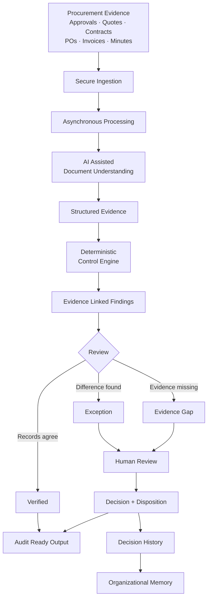
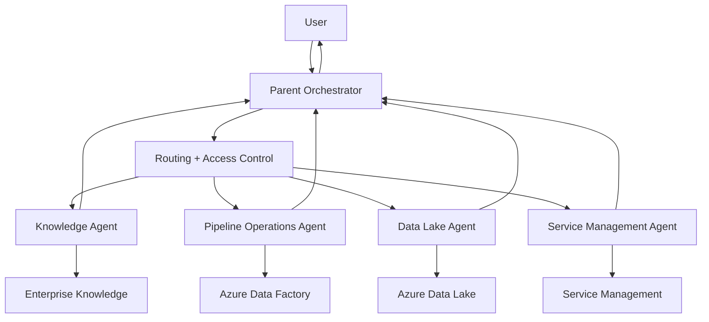
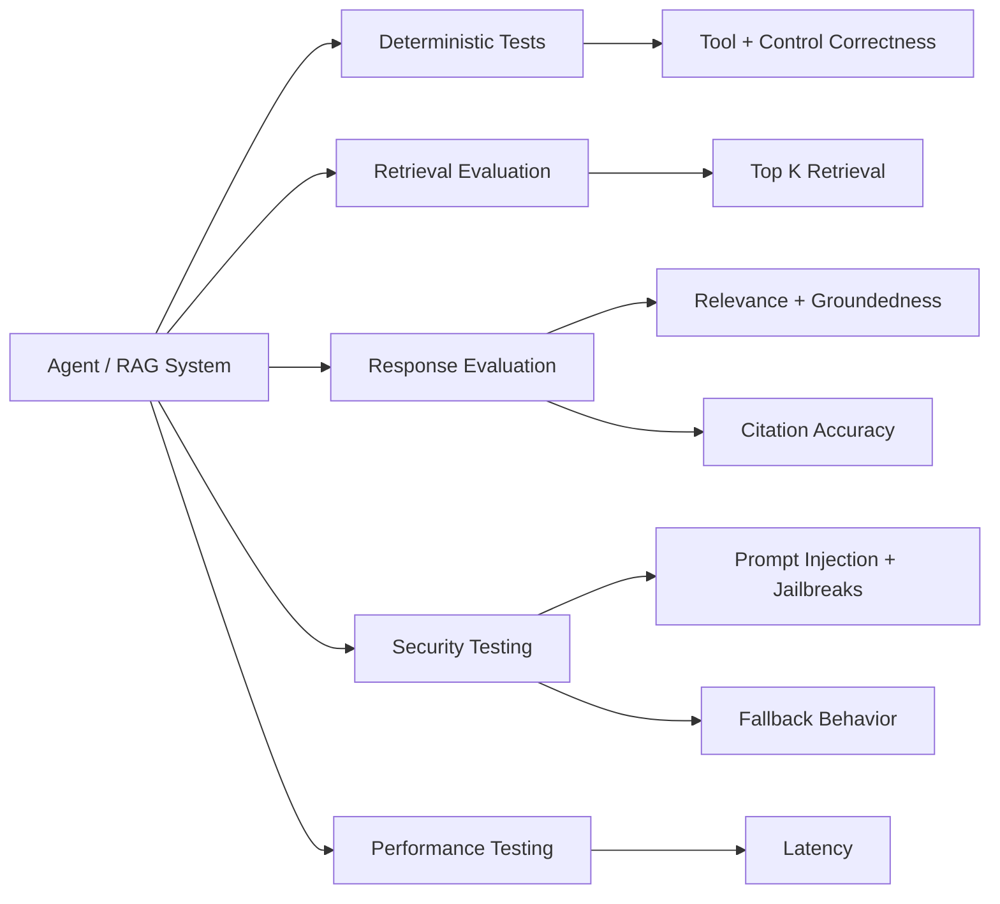

# Neeraj Mohanty

I build applied AI systems for procurement, enterprise operations, healthcare, and evidence heavy workflows.

My background is in capital sourcing and project management within Canadian healthcare. I started building software around problems I encountered directly: procurement review, fragmented evidence, internal knowledge retrieval, compliance checks, and operational decision making.

My current work focuses on systems where AI helps interpret information while important conclusions remain traceable, testable, and reviewable.

GitHub: [github.com/NeerajMohanty](https://github.com/NeerajMohanty)

---

## Currently Building

### ProcureTrace

**The control layer between evidence and decision.**

[ProcureTrace](https://procuretrace.com/) is a procurement evidence control system that checks approvals, quotes, contracts, purchase orders, delivery records, invoices, and other supporting records against each other.

Instead of asking an LLM to decide whether a procurement is correct, ProcureTrace separates document understanding from control evaluation:

```text
AI reads → structured evidence → deterministic controls → human exception review → audit ready decision record
```

The system identifies:

- records that agree
- conflicting values or decisions
- missing required evidence
- conclusions that cannot be sufficiently supported

Every finding remains connected to its underlying source evidence.

#### Architecture



#### Design principle

AI interprets the evidence. Deterministic logic evaluates the controls. Humans resolve exceptions.

This separation is useful where conclusions must be explainable, reproducible, and connected to source evidence rather than generated as an opaque AI answer.

#### Longer term direction

Procurement is the starting point.

The broader goal is an evidence backed organizational memory that captures not only what an organization knows, but:

- what was expected
- what actually happened
- which evidence supported it
- which control applied
- where an exception occurred
- what decision was made
- why that decision was accepted

Over time, those records can form a persistent history of organizational decisions and their provenance.

Live product: [procuretrace.com](https://procuretrace.com/)

Core implementation is private. This architecture shows the system boundary without exposing internal extraction, routing, control, or persistence implementation.

---

### Byzcard

**A local first, open source digital business card.**

[Byzcard](https://byzcard.cc/) lets users create and share a digital business card without requiring an account or storing the primary card in a central database.

Card information stays on the user's device unless the user chooses a feature that requires a shareable link.

#### Key capabilities

- Local first card creation
- QR sharing
- Readable share links
- Native mobile sharing
- Printable card export
- PWA installation
- Offline use
- Import and export backup
- Mobile focused interaction
- Automated unit and end to end testing

#### Stack

Next.js · TypeScript · React · Vitest · Playwright · Vercel

Live: [byzcard.cc](https://byzcard.cc/)
Source: [github.com/NeerajMohanty/byzcard](https://github.com/NeerajMohanty/byzcard)

---

### KnowAutism Content Monitor

**Change detection for government program information without sending unchanged pages through an LLM.**

[KnowAutism Content Monitor](https://github.com/NeerajMohanty/knowautism-content-agent) monitors official government sources for changes to autism programs and services.

The workflow separates deterministic change detection from AI assisted interpretation.

```text
Official source
      ↓
Content extraction
      ↓
Content hash
      ↓
Changed?
   ↙       ↘
 No        Yes
 ↓          ↓
Stop      AI comparison
             ↓
        Review item
             ↓
        Human approval
```

If a source has not changed, processing stops before making a model call.

When a change is detected, relevant content is sent for structured comparison and surfaced for human review.

#### Design goals

- Reduce unnecessary model calls
- Keep source material traceable
- Detect meaningful program changes
- Control operating cost
- Keep publication decisions under human review

Source: [github.com/NeerajMohanty/knowautism-content-agent](https://github.com/NeerajMohanty/knowautism-content-agent)

---

## Enterprise Agent Orchestration

I have also worked on enterprise AI architecture where a parent agent coordinates specialized agents for knowledge retrieval and operational investigation.

The architecture uses LangGraph based orchestration rather than placing every capability inside a single agent.



### Design approach

One orchestrator. Focused subagents. Narrow tool permissions. Explicit system boundaries.

Each specialized agent owns a defined capability and its tools.

The parent agent decides which capability is required and delegates the task.

This keeps individual agents smaller and makes permissions, testing, routing, and failure behavior easier to reason about.

### Capabilities explored and implemented

- LangGraph based agent orchestration
- Task focused subagents
- Enterprise knowledge retrieval
- Source grounded answers
- Azure Data Factory run investigation
- Azure Data Lake metadata retrieval
- Data quality configuration retrieval
- Service management integrations
- Typed tool interfaces
- Environment based configuration
- Streaming agent activity
- Conditional capability registration
- Group based access control
- Managed identity authentication
- Read only Azure data access
- Deterministic offline testing

### Expected versus observed state

A design principle used in the operational agents is to keep configuration separate from observed evidence.

For example:

```text
EXPECTED

Where should a file arrive?
When should it arrive?
Which rules should apply?

        ↓

ACTUAL

What file actually arrived?
When did it arrive?
What metadata was observed?

        ↓

EVALUATION / DOWNSTREAM DECISION
```

An expected configuration is not treated as proof that something actually happened.

Likewise, an observation does not automatically become a business judgment.

That separation reduces the amount of decision logic delegated to the language model.

### Enterprise boundaries

Capabilities can be registered only when their underlying systems are configured.

Access can also be restricted independently by capability.

This means an agent does not advertise a tool it cannot use, and a user can retain access to permitted capabilities while restricted capabilities remain unavailable.

Authentication uses Azure identity rather than embedding production credentials into application code.

This section is a sanitized architecture summary. Client identifiers, internal infrastructure, implementation details, credentials, and proprietary source code are intentionally excluded.

---

## AI Evaluation

I also work on evaluation frameworks for RAG and agent systems.

The goal is not to evaluate an AI system with a single generic accuracy score.

Different parts of the system fail differently and should be measured separately.



### Evaluation areas

**Retrieval**

- Top K retrieval accuracy
- Source selection
- Retrieval regression

**Response quality**

- Relevance
- Groundedness
- Citation accuracy
- Reference based evaluation

**Agent behavior**

- Tool selection
- Tool argument validation
- Instruction following
- Fallback behavior
- Human review boundaries

**Security**

- Prompt injection
- Indirect prompt injection
- Jailbreak resistance
- Multi turn attacks
- Excessive agency
- Data leakage scenarios

**Performance**

- End to end latency
- p95 latency
- Model and retrieval performance

### Evaluation approach

The evaluation stack combines deterministic assertions with model based evaluators.

```text
Code based checks
        +
Retrieval metrics
        +
LLM based evaluation
        +
Adversarial tests
        +
Human review where needed
```

The objective is to detect regressions in retrieval, grounding, citations, tool behavior, safety, and latency before treating an agent as production ready.

---

## How I Build

I am interested in AI systems where model output is not treated as the final authority.

For evidence sensitive workflows, I prefer a structure closer to:

```text
Source information
        ↓
AI interpretation
        ↓
Structured evidence
        ↓
Deterministic logic
        ↓
Traceable finding
        ↓
Human review when required
```

This keeps AI useful for interpretation, extraction, classification, retrieval, and routing while moving critical controls into software that can be tested and reproduced.

I care about:

- evidence provenance
- deterministic controls
- agent boundaries
- retrieval quality
- failure states
- unsupported conclusions
- evaluation
- human review
- security
- privacy
- operating cost
- reproducibility

---

## Areas I Work In

**Applied AI**
Document understanding · RAG · agent orchestration · structured extraction · evaluation · tool calling

**Agent Systems**
LangGraph · subagent orchestration · routing · tool integration · human review patterns

**AI Evaluation**
Groundedness · relevance · citation evaluation · retrieval evaluation · adversarial testing · latency

**Product Engineering**
Next.js · React · TypeScript · Python · Node.js

**Cloud**
Microsoft Azure · AWS · Vercel · Terraform · GitHub Actions

**Azure**
Azure OpenAI · Azure AI Search · Azure Data Factory · Azure Data Lake Storage · Managed Identity

**Testing**
Pytest · Vitest · Playwright · deterministic test fixtures · automated AI evaluation

---

## Domain Background

My software work is informed by experience in capital sourcing and project delivery within healthcare.

That work involves coordinating information across:

- procurement
- capital planning
- vendor submissions
- contracts
- clinical teams
- engineering
- facilities
- IT
- finance
- compliance requirements
- public sector processes

A recurring problem is that the evidence behind a decision is fragmented across documents, emails, spreadsheets, enterprise systems, policies, meeting records, and institutional knowledge.

A large part of what I build now comes from that problem.

---

## Earlier Work

Earlier repositories include experiments with document simplification, retrieval systems, AI assistants, and agent applications.

They represent the progression from smaller AI experiments toward systems with stronger evaluation, control logic, evidence tracing, and operational constraints.

[View all repositories](https://github.com/NeerajMohanty?tab=repositories)

---

## Current Focus

**ProcureTrace**
Building an evidence control layer for procurement and broader organizational decision workflows.

**Enterprise AI**
Building and studying agent orchestration, retrieval, evaluation, tool integration, and operational AI systems.

**Byzcard**
Developing a simple, privacy conscious, open source approach to digital identity and business card sharing.

---

## Contact

GitHub: [github.com/NeerajMohanty](https://github.com/NeerajMohanty)
ProcureTrace: [procuretrace.com](https://procuretrace.com/)
Byzcard: [byzcard.cc](https://byzcard.cc/)
LinkedIn: [linkedin.com/in/neerajmohanty](https://www.linkedin.com/in/neerajmohanty/)
